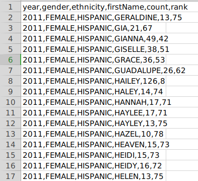
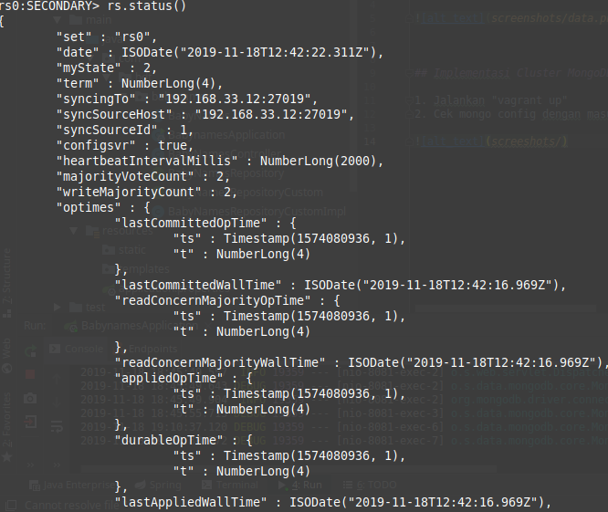
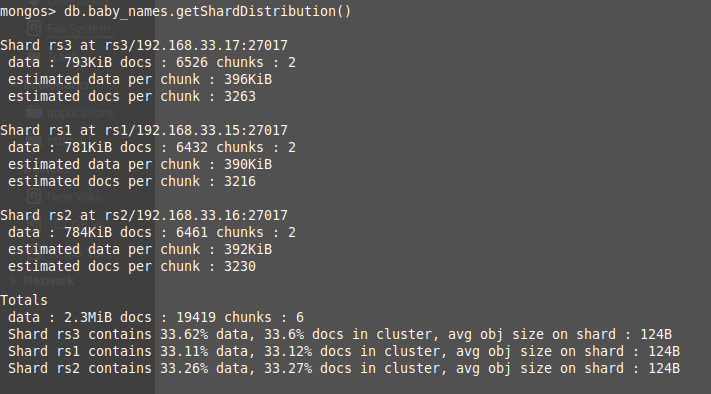

## Dataset
Dataset yang digunakan adalah
https://catalog.data.gov/dataset/most-popular-baby-names-by-sex-and-mothers-ethnic-group-new-york-city-8c742




## Implementasi Cluster MongoDB

1. Jalankan "vagrant up"
2. Setelah selesai, ssh ke mongo_config_1
2. Jalankan "rs.status()" pada terminal mongo, maka akan muncul sesuai dengan gambar berikut



3. Ssh ke mongo_query_router
4. Jalankan "use bdtDB"
5. Jalankan "db.baby_names.getSharedDistribution()" maka akan muncul sesuai gambar berikut




## Implementasi aplikasi

Aplikasi yang digunakan memiliki api spec sebagai berikut:


GET: /baby_names/{id}

response:
```json
{
    "id": "5dcfd32838504bb44c1239df",
    "year": 2011,
    "gender": "FEMALE",
    "ethnicity": "HISPANIC",
    "firstName": "GIA",
    "count": 21,
    "rank": 67
}
```


POST: /baby_names

request:
```json
{
	"year" : "1998",
	"gender": "MALE",
	"ethnicity": "HISPANIC",
	"firstName" :"GIA",
	"count":"1",
	"rank": "100"
}
```

response:
```json
{
	"id" : "5dcfd32838504bb44c1239df",
	"year" : "1998",
	"gender": "MALE",
	"ethnicity": "HISPANIC",
	"firstName" :"GIA",
	"count":"1",
	"rank": "100"
}
```

PUT: /baby_names/{id}?count=16

response:
```json
{
	"id" : "5dcfd32838504bb44c1239df",
	"year" : "1998",
	"gender": "MALE",
	"ethnicity": "HISPANIC",
	"firstName" :"GIA",
	"count":"16",
	"rank": "100"
}
```

Delete: /baby_names/{id}


GET: /baby_names/top_names

Penjelasan: mencari nama terpopuler untuk setiap "ethnicity"

response:
```json
[
    {
        "year": 2013,
        "gender": "ASIAN AND PACIFIC ISLANDER",
        "ethnicity": "ASIAN AND PACIFIC ISLANDER",
        "firstName": "Jayden",
        "count": 220
    },
    {
        "year": 1998,
        "gender": "tionghua",
        "ethnicity": "tionghua",
        "firstName": "alfian",
        "count": 16
    },
    {
        "year": 2012,
        "gender": "ASIAN AND PACI",
        "ethnicity": "ASIAN AND PACI",
        "firstName": "RYAN",
        "count": 197
    },
    {
        "year": 2012,
        "gender": "BLACK NON HISP",
        "ethnicity": "BLACK NON HISP",
        "firstName": "JAYDEN",
        "count": 171
    },
    {
        "year": 2012,
        "gender": "WHITE NON HISP",
        "ethnicity": "WHITE NON HISP",
        "firstName": "JOSEPH",
        "count": 300
    },
    {
        "year": 2013,
        "gender": "WHITE NON HISPANIC",
        "ethnicity": "WHITE NON HISPANIC",
        "firstName": "David",
        "count": 304
    },
    {
        "year": 2011,
        "gender": "HISPANIC",
        "ethnicity": "HISPANIC",
        "firstName": "JAYDEN",
        "count": 426
    },
    {
        "year": 2011,
        "gender": "BLACK NON HISPANIC",
        "ethnicity": "BLACK NON HISPANIC",
        "firstName": "JAYDEN",
        "count": 184
    }
]
```

GET: /baby_names/sum_names

Penjelasan: menghitung jumlah "count" setiap "ethnicity"

response:
```json
[
     {
         "ethnicity": "ASIAN AND PACIFIC ISLANDER",
         "count": 68690
     },
     {
         "ethnicity": "ASIAN AND PACI",
         "count": 19485
     },
     {
         "ethnicity": "BLACK NON HISP",
         "count": 19010
     },
     {
         "ethnicity": "WHITE NON HISP",
         "count": 50479
     },
     {
         "ethnicity": "WHITE NON HISPANIC",
         "count": 200692
     },
     {
         "ethnicity": "HISPANIC",
         "count": 216716
     },
     {
         "ethnicity": "BLACK NON HISPANIC",
         "count": 75821
     }
 ]
```