# Arsitektur

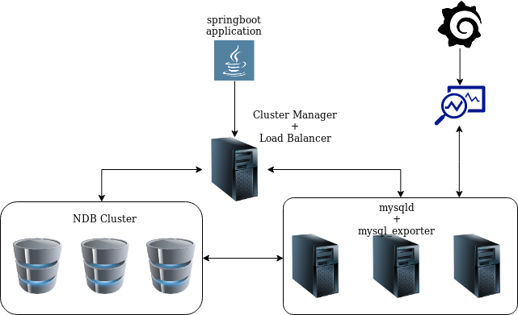

# Instalasi

Jalankan 

1. `wget https://dev.mysql.com/get/Downloads/MySQL-Cluster-7.6/mysql-cluster-community-management-server_7.6.6-1ubuntu18.04_amd64.deb`
2. `wget https://dev.mysql.com/get/Downloads/MySQL-Cluster-7.6/mysql-cluster-community-data-node_7.6.6-1ubuntu18.04_amd64.deb`
3. `wget https://dev.mysql.com/get/Downloads/MySQL-Cluster-7.6/mysql-cluster_7.6.6-1ubuntu18.04_amd64.deb-bundle.tar`
4. `vagrant up`


## Instalasi dan Konfigurasi Cluster Manager

semua instalasi dan konfigurasi sudah dilakukan melalui file provision `provision/manager_bootstrap.sh`,
untuk mengecek apakah ndb cluster manager sudah berjalan maka lakukan hal berikut ini:
1. `vagrant ssh manager`
2. `sudo systemctl status ndb_mgmd`

maka seharusnya muncul output sebagai berikut

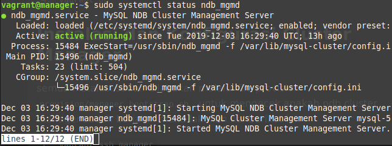


## Instalasi dan konfigurasi Data Nodes
semua instalasi dan konfigurasi sudah dilakukan melalui file provision `provision/data_bootstrap.sh`
untuk mengecek apakah ndb sudah berjalan, lakukan hal ini pada masing-masing vm :
1. `vagrant ssh [ip vm ndb: (192.168.16.77, 192.168.16.78, 192.168.16.79)]`
2. `sudo systemctl status ndbd`

maka seharusnya muncul output sebagai berikut

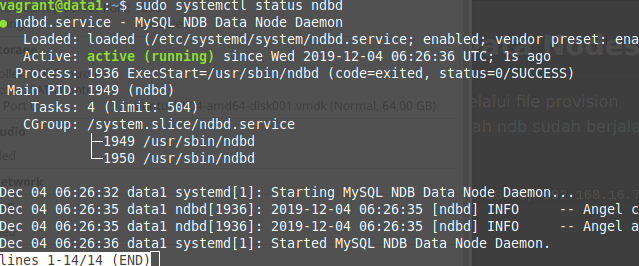

## Instalasi dan Konfigurasi Mysql Server dan Client
sebagian instalasi sudah dilakukan melalui file `provision/service_bootstrap.sh`, sisanya adalah sebagai berikut:

1. `cd install/`
2. `sudo dpkg -i mysql-server_7.6.6-1ubuntu18.04_amd64.deb`
3. masukkan password yang diminta, tunggu instalasi sampai selesai
4. `sudo nano /etc/mysql/my.cnf`
5. tambahkan config berikut ke dalam file, sesuaikan `bind-address` dengan IP vm tersebut
    ```
    !includedir /etc/mysql/conf.d/
    !includedir /etc/mysql/mysql.conf.d/
    [mysqld]
    # Options for mysqld process:
    ndbcluster                      # run NDB storage engine
    bind-address = 192.168.16.74
    [mysql_cluster]
    # Options for NDB Cluster processes:
    ndb-connectstring=192.168.16.73  # location of management server
    ```

6. `sudo systemctl restart mysql`
7. `sudo systemctl enable mysql`
8. `mysql -u root -p `
9. tambahkan user dan permission dengan:
    ```
    CREATE USER 'bdtuser'@'%' IDENTIFIED BY 'password';
    GRANT ALL PRIVILEGES ON *.* TO 'bdtuser'@'%' WITH GRANT OPTION;    
    ```
10. cek status NDB Engine dengan `SHOW ENGINE NDB STATUS \G`, seharusnya muncul output sebagai berikut
    ```
    *************************** 1. row ***************************
      Type: ndbcluster
      Name: connection
    Status: cluster_node_id=5, connected_host=192.168.16.73, connected_port=1186, number_of_data_nodes=3, number_of_ready_data_nodes=0, connect_count=1
    *************************** 2. row ***************************
      Type: ndbcluster
      Name: NdbTransaction
    Status: created=3, free=3, sizeof=368
    *************************** 3. row ***************************
      Type: ndbcluster
      Name: NdbOperation
    Status: created=6, free=6, sizeof=944
    *************************** 4. row ***************************
      Type: ndbcluster
      Name: NdbIndexScanOperation
    Status: created=0, free=0, sizeof=1152
    *************************** 5. row ***************************
    .  .  .  .
    ```
11. set default engine storage dengan `set default_storage_engine=ndbcluster;`

Setelah melakukan 3 instalasi diatas cek cluster manager dengan:
1. `ndb_mgm`
2. `show`
maka seharusnya keluar output sebagai berikut:
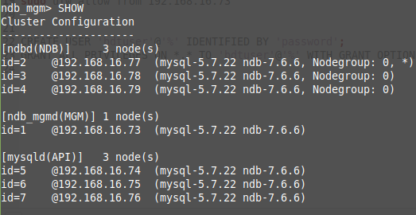

Lalu cek juga proxy sql
1. `mysql -u admin -p -h 127.0.0.1 -P 6032`
2. `SELECT hostgroup_id, hostname, status FROM runtime_mysql_servers;` maka akan muncul output sebagai berikut
   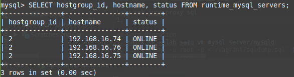

## Data Migration
1. masuk ke salah satu vm mysql server/mysqld
2. `sudo mysql -u root -p < /vagrant/sqldump.sql` tunggu sampai selesai
3. `sudo mysql -u root -p`
4. `use bdtDB;select * from baby_names;` maka seharusnya muncul output sebagai berikut:
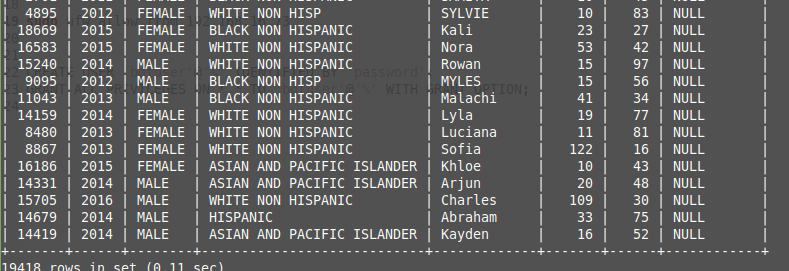

## Instalasi web server
Pada tahap ini, akan dilakukan instalasi web server dengan framework springboot.

Berikut adalah tahap instalasinya: 

1. `cd babynames-spring/`
2. `mvn install`
3. `mvn spring-boot:run`

setelah itu seharusnya akan muncul output sebagai berikut.

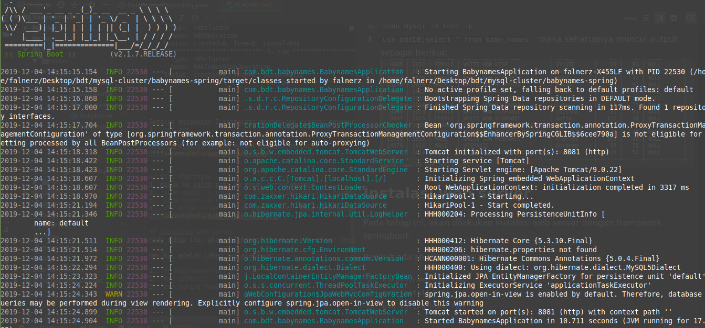


# Uji Performa

## A. Jmeter
Berikut adalah hasil pengujian performa pada API pada url 
`http://localhost:8081/baby_names/1`

1. 100 koneksi
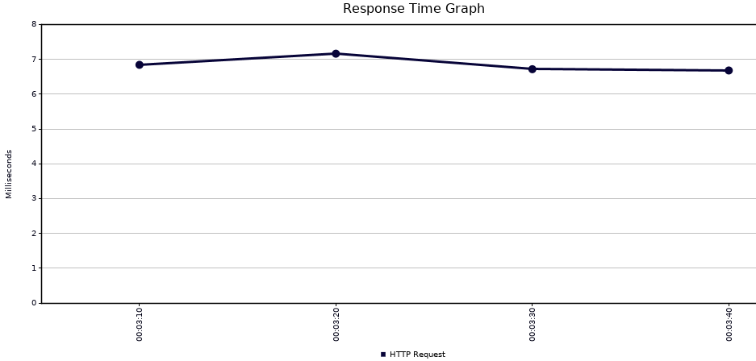

2. 500 koneksi
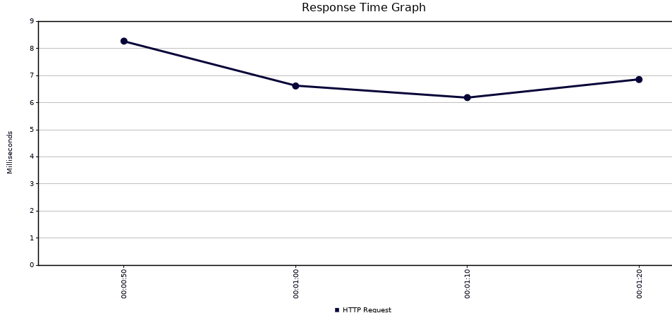

## B. Sysbench

1. inisiasi data test dari sysbench
    ```
    sysbench /usr/share/sysbench/oltp_read_write.lua --mysql-host=192.168.16.74 --mysql-port=3306 --mysql-user=bdtuser --mysql-password='password' --mysql-db=bdtDB --db-driver=mysql --tables=3 --table-size=1000 --mysql-table-engine=ndbcluster  prepare
    ```

2. lakukan benchmarking
    ```
    sysbench /usr/share/sysbench/oltp_read_write.lua --mysql-host=192.168.16.73 --mysql-port=6033 --mysql-user=bdtuser --mysql-password='password' --mysql-db=bdtDB --db-driver=mysql --tables=3 --table-size=1000 --report-interval=10 --threads=16 --time=10 run 2>&1
    ```
Berikut perbandingan menggunakan 1,2 dan 3 server

A. 1 server
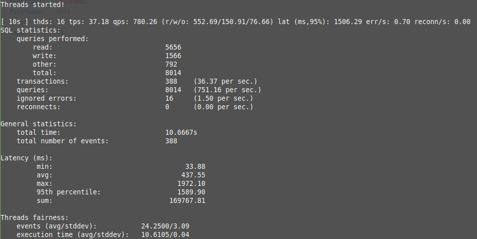
    
B. 2 server
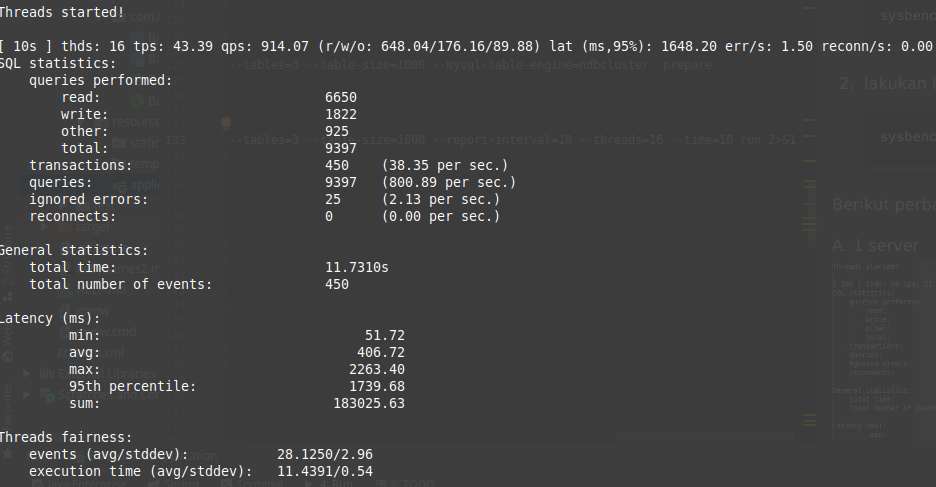
 
C. 3 server
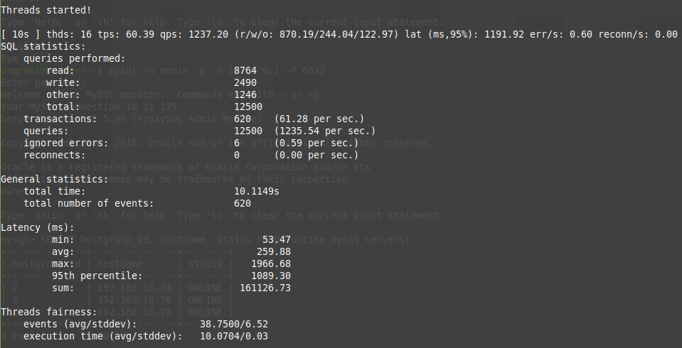


# Monitoring
## Instalasi Mysql Exporter
Download dulu mysqld_exporter dengan `wget https://github.com/prometheus/mysqld_exporter/releases/download/v0.11.0/mysqld_exporter-0.11.0.linux-amd64.tar.gz`

Untuk setiap vm server lakukan hal berikut.
1. `sudo tar xvzf /vagrant/mysqld_exporter-0.11.0.linux-amd64.tar.gz`
2. `cd mysqld_exporter-0.11.0.linux-amd64/`
3. `sudo mv mysqld_exporter /usr/local/bin/`
4. `sudo nano /etc/.exporter.cnf`, lalu paste config berikut
    ```
    [client]
    host=192.168.16.74 #sesuaikan IP masing-masing VM
    user=bdtuser
    password=password
    ``` 
5. `sudo nano /lib/systemd/system/mysql_exporter.service` lalu paste config berikut ini, sesuaikan IP untuk masing-masing vm
   ```
   [Unit]
   Description=MySQL Exporter
   
   [Service]
   Type=simple
   Restart=always
   ExecStart=/usr/local/bin/mysqld_exporter \
   --config.my-cnf /etc/.exporter.cnf \
   --collect.auto_increment.columns \
   --collect.binlog_size \
   --collect.engine_innodb_status \
   --collect.global_status \
   --web.listen-address=192.168.16.74:9104
   
   [Install]
   WantedBy=multi-user.target
   ```
   
6. `sudo systemctl daemon-reload`
7. `sudo systemctl start mysql_exporter.service`
7. `sudo systemctl status mysql_exporter.service`

## Instalasi Prometheus
Lakukan instalasi ini di local
1. `wget https://github.com/prometheus/prometheus/releases/download/v2.0.0/prometheus-2.0.0.linux-amd64.tar.gz`
2. `tar xvf prometheus-2.0.0.linux-amd64.tar.gz`
3. `sudo cp prometheus-2.0.0.linux-amd64/prometheus /usr/local/bin/`
4. `sudo cp prometheus-2.0.0.linux-amd64/promtool /usr/local/bin/`
5. `sudo cp -r prometheus-2.0.0.linux-amd64/consoles /etc/prometheus`
6. `sudo cp -r prometheus-2.0.0.linux-amd64/console_libraries /etc/prometheus`
7. `sudo nano /etc/prometheus/prometheus.yml` lalu copy config berikut
    ```
    global:
      scrape_interval: 15s
    scrape_configs:
      - job_name: 'prometheus'
        scrape_interval: 5s
        static_configs:
          - targets: ['localhost:9090']
    
      - job_name: 'mysql'
        scrape_interval: 5s
        static_configs:
          - targets: ['192.168.16.74:9104','192.168.16.75:9104','192.168.16.76:9104']
          
    ```
8.  lalu `sudo nano /etc/systemd/system/prometheus.service`, copy config dibawah ini
    ```
    [Unit]
    Description=Prometheus
    Wants=network-online.target
    After=network-online.target
    
    [Service]
    Type=simple
    ExecStart=/usr/local/bin/prometheus \
        --config.file /etc/prometheus/prometheus.yml \
        --storage.tsdb.path /var/lib/prometheus/ \
        --web.console.templates=/etc/prometheus/consoles \
        --web.console.libraries=/etc/prometheus/console_libraries
    
    [Install]
    WantedBy=multi-user.target
    ```
9. `sudo systemctl daemon-reload`
10. `sudo systemctl start prometheus`

## Instalasi Grafana

1. `sudo wget -q -O - https://packages.grafana.com/gpg.key | apt-key add -`
2. `sudo apt-get update`
3. `sudo apt-get install grafana`
4. `sudo systemctl start grafana-server`
5. add data source, dengan url `http://localhost:9090` lalu save
   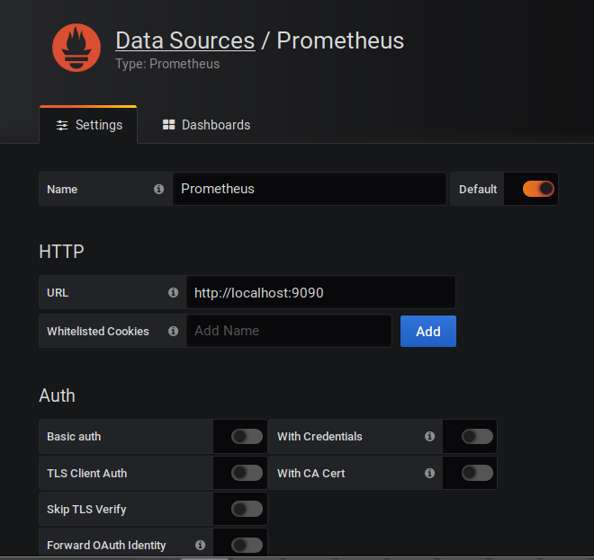
6. buka page berikut `http://localhost:3000/datasources/edit/1/`
7. masukkan kode `7362` lalu enter, maka akan muncul seperti berikut, lalu tekan import
   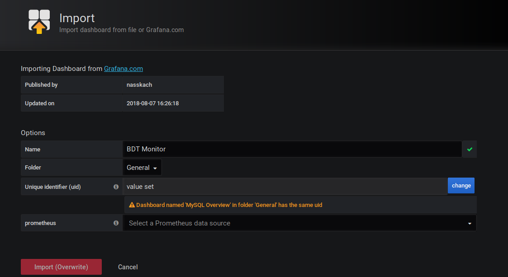
8. berikut adalah page monitor
   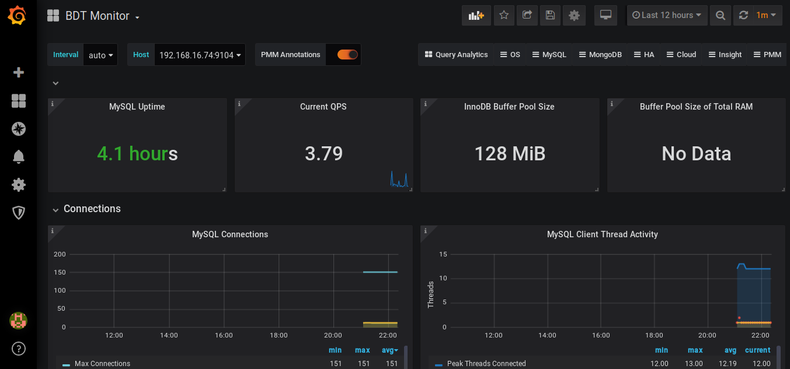
   
