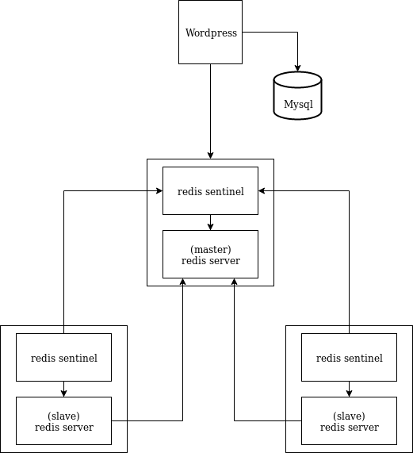
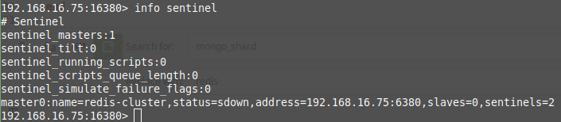

# Redis Cluster

## Arsitektur

## Instalasi

- jalankan ``vagrant up``

- cek redis replication info pada setiap server dengan ``redis-cli -h [ip server] -p 6380``, lalu ``info replication``, maka outputnya seperti dibawah ini:

redis info master:

redis info slave 1:

redis info slave 2:

- cek juga redis sentinel info pada setiap server dengan ``redis-cli -h [ip server] -p 16380``, lalu ``info sentinel``, maka outputnya seperti dibawah ini:

redis info master:

redis info slave 1:

redis info slave 2

## Wordpress
- Pada wp-config.php tambahkan ``define('FS_METHOD','direct')`` untuk mengallow wordpress menginstall plugin secara langsung tanpa menggunakan FTP
- Tambahkan config berikut pada wp-config.php

- Install Plugin Redis Object Cache lalu allow plugin

## Pengujian dengan jmeter
Path yang diuji adalah path

``/index.php/2019/11/22/hello-world/``

dengan catatan komentar pada postingan tersebut sudah ditambahkan agar query ke mysql lebih berat
### 1. Dengan Redis Object Cache

*50 request selama 10 detik*

*173 request selama 10 detik*

*273 request selama 10 detik*

### 2. Tanpa Redis Object Cache 

*50 request selama 10 detik*

*173 request selama 10 detik*

*273 request selama 10 detik*

Kenapa menggunakan Redis Object Cache membuat response time menjadi naik / lebih lambat?, Untuk menguji ini, maka lakukan monitoring pada redis dengan

``redis-cli -h 192.168.16.73 -p 6380 monitor``

Coba request 1 kali ke page, lalu lihat hasil monitor tadi.

Untuk 1 kali request jumlah hit ke redis server sangat banyak, jauh lebih banyak daripada jumlah hit ke mysql. Hal ini menyebabkan overhead pada redis server.